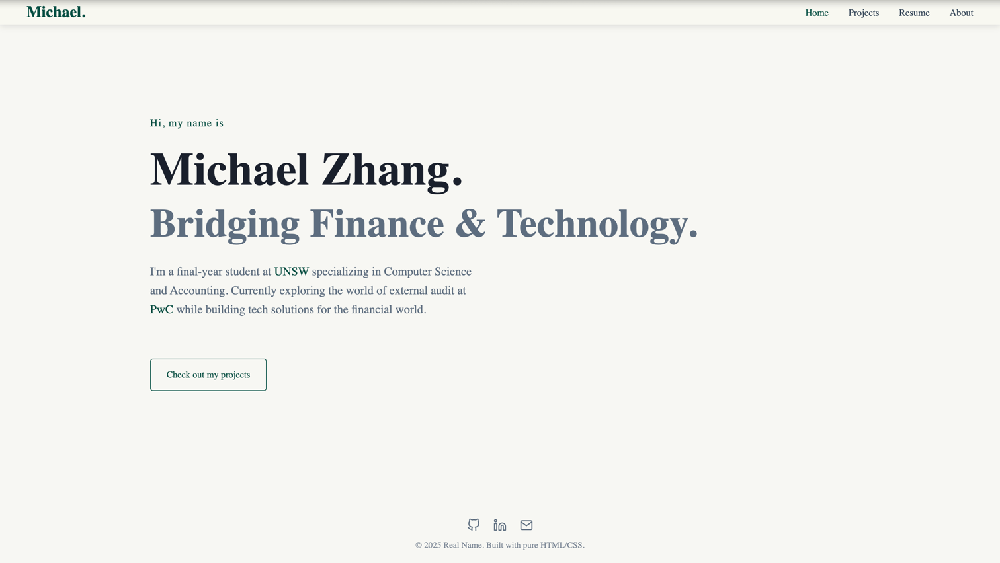

# Michael Zhang | FinTech & CS Portfolio


> A minimalist, responsive, and performance-focused portfolio website bridging the gap between Finance and Technology.
> **Live Demo:** [https://michaelzhang.dev](https://michaelzhang.dev)

## About

This project is a custom-built personal website designed to showcase professional experience in Accounting, External Audit (PwC), and Software Engineering.



It is built with **Pure HTML, CSS, and Vanilla JavaScript**, deliberately avoiding heavy frameworks (React, Next.js) to ensure maximum performance, longevity, and ease of maintenance. The design follows a "Smart Professional" aesthetic—clean, authoritative, yet modern.

## Key Features

- **🎨 Adaptive Theme**: Automatically detects system preferences to switch between a professional **Dark Navy** theme and a warm **Paper/Cream** light theme.
- **📱 Fully Responsive**: Built with CSS Grid and Flexbox to look perfect on mobile, tablet, and desktop.
- **🖨️ Print-Ready Resume**: The Resume page includes a dedicated `@media print` stylesheet. Pressing `Ctrl/Cmd + P` generates a clean, A4-formatted black & white resume, hiding web navigation elements.
- **⚡ Zero Dependencies**: No Bootstrap, no Tailwind, no jQuery. Just semantic HTML and optimized CSS.
- **🔍 SEO Optimized**: Includes Open Graph tags for beautiful link previews on LinkedIn and social media.
- **🎬 Micro-Interactions**: Subtle scroll animations using the native `IntersectionObserver` API.

## Project Structure

```text
/
├── index.html          # Home / Hero Landing
├── projects.html       # Technical Projects Gallery
├── resume.html         # Professional Resume (Web + Print)
├── about.html          # Bio & Storytelling
├── README.md           # Documentation
└── /assets
    ├── /css
    │   ├── style.css    # Global variables, nav, footer, reset
    │   ├── home.css     # Home specific styles
    │   ├── projects.css # Grid layout for cards
    │   ├── resume.css   # Resume styling + Print logic
    │   └── about.css    # About page layout
    ├── /js
    │   └── main.js      # Animation logic & Nav handling
    ├── /images          # Profile pic, icons, OG images
    └── /files           # PDF Resume download
```

## Local Development

Since this project uses static files, no build step (npm/yarn) is required.

1. Clone the repository

```bash
git clone [https://github.com/petryiy/portfolio.git](https://github.com/petryiy/portfolio.git)
cd portfolio
```

2. Run Locally
- Simply open `index.html` in your browser.
- OR use a live server (VS Code Extension) for hot-reloading.

## License
This project is open source and available under the MIT License.

Designed & Built in 2025.

